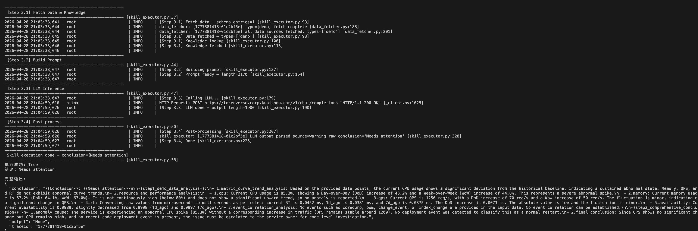

# Bianque System

<p align="left">
        <a href="README_CN.md">中文</a> | English
</p>
<br>

> Bianque System: An LLM-driven Intelligent Skill Execution Framework for SRE/Operations

Bianque System is an open-source operations AI framework. Its core idea is: **describe analysis Skills as files, let LLM auto-generate and execute them, with feedback-driven updates — covering alert analysis, inspection, and change guard scenarios**.

The framework runs as a Flask service. It is not tied to any internal data source or specific LLM. All integration points are defined as interfaces — developers only need to implement their own data fetch logic and LLM connection to run the full pipeline.

**This framework provides the workflow skeleton for Skill execution** (Parse → Search → Fetch Data → Build Prompt → LLM Inference → Post-process → Feedback Update), not a complete Agent system. For Agent capabilities such as context management, multi-turn conversation, tool call orchestration, RAG, sandbox execution, etc., users should implement or integrate third-party Agent frameworks as needed.

---

## Key Features

- See paper: Bian Que: An Agentic Framework with Flexible Skill Arrangement for Online System Operations

---

## Directory Structure

```
BianQue_Assistant/
├── run_demo.py                              # Local demo script (no Flask needed)
├── requirements.txt
├── src/
│   ├── main.py                              # Flask entry point, HTTP routes
│   └── app/
│       ├── framework/
│       │   ├── model/
│       │   │   └── llm.py                   # Unified LLM call layer (OpenAI-compatible built-in)
│       │   ├── data/
│       │   │   ├── providers.py             # Data fetch implementations (TODO: plug in your sources)
│       │   │   ├── data_provider_registry.py  # Data capability registry (auto-loads providers.py)
│       │   │   ├── data_fetcher.py          # Parallel data fetch engine
│       │   │   ├── data_lake.yaml           # Data capability config (type / handler / description)
│       │   │   └── demo_data/               # Demo data directory
│       │   │       ├── performance.json     # Demo service performance metrics
│       │   │       ├── knowledge.json       # Demo knowledge base entries
│       │   │       └── mock_alert_request.json  # Demo alert request body
│       │   ├── knowledge/
│       │   │   └── get_knowlege.py          # Knowledge retrieval interface (TODO: plug in your KB)
│       │   └── conf/
│       │       └── conf_manager.py         # Local config manager (Skill file read/write)
│       ├── skill_explore/
│       │   ├── skill_explore_main.py        # Scene entry points (run_warning / run_inspect…)
│       │   ├── input_parser.py              # Request parsing adapter (TODO: implement your parsing)
│       │   ├── skill_create.py              # LLM-driven Skill generation (two-stage: Schema → Prompt)
│       │   ├── skill_executor.py            # Skill execution engine (4-step workflow)
│       │   ├── skill_search.py              # Skill search (business + scene matching)
│       │   ├── skill_md_manager.py          # Skill Markdown file read/write
│       │   └── skill_feedback.py            # Skill content feedback update
│       ├── local_config/                    # Local config files (auto-generated, no manual edit needed)
│       │   ├── bianque_skill_registry.txt   # Skill registry (key → file path mapping, generated on first run)
│       │   ├── bianque_skill_biz_classify.txt   # Business classification config (for Skill matching)
│       │   ├── bianque_skill_data_lake_summary.txt  # Data capability summary (used by skill_create)
│       │   ├── stage2_prompt_usability_warning.txt  # Stage2 system prompt for usability_warning
│       │   ├── stage2_prompt_coredump_warning.txt   # Stage2 system prompt for coredump_warning
│       │   ├── stage2_prompt_inspect.txt            # Stage2 system prompt for inspection
│       │   └── skill_*.txt                          # Auto-generated Skill files (created on first run)
│       ├── business/                    # Business-specific logic (add as needed)
│       │   ├── ad/
│       │   ├── reco/
│       │   └── search/
│       └── util/
│           └── logger.py                    # Logging utilities (info_log / error_log / business_log)
```

---

## Quick Start

> **Just set the LLM environment variables and run `run_demo.py` to execute the full pipeline on mock data — no additional development needed.**
> Steps 3–5 below are for integrating your own system capabilities and are optional.

### 1. Install Dependencies

```bash
cd BianQue_Assistant
pip3 install -r requirements.txt
```

### 2. Configure LLM (Required)

The framework includes a built-in `OpenAICompatibleClient`. Set environment variables to use it:

```bash
export LLM_API_BASE="https://your-api-endpoint/v1"
export LLM_API_KEY="your_api_key"
export LLM_MODEL="your_model_name"   # default: qwen3
```

Then run the demo immediately:

```bash
python run_demo.py
```

To use a custom LLM backend, subclass `BaseLLMClient` and register it at startup in `main.py`:

```python
from app.framework.model.llm import BaseLLMClient, set_llm_client

class MyLLMClient(BaseLLMClient):
    def chat(self, user_prompt, system_prompt="", request_id=""):
        return my_api.call(system_prompt, user_prompt)

set_llm_client(MyLLMClient())
```

---

The following steps are for integrating the framework with your own system capabilities:

### 3. Implement Request Parsing (Integrate Your Alert System)

Edit `src/app/skill_explore/input_parser.py` and implement `parse_warning()` to parse raw alert requests into `ParsedInput`.

The demo implementation derives the business ID from a `_mock_biz_id` field in a flat JSON. For production, replace this with your real alert payload parsing logic (e.g., from Prometheus AlertManager, PagerDuty, or your internal alert platform).

Key fields to extract and map:
- `business_id` — used to match the correct Skill
- `scene_id` — determines which analysis workflow to run (e.g., `usability_warning`, `coredump_warning`)
- `context` — runtime variables injected into data fetch calls (`service_name`, `timestamp`, etc.)

```python
def parse_warning(self, data, request_id: str = ""):
    business_id = ...   # e.g. "search", "ad"
    scene_id    = ...   # e.g. "usability_warning", "coredump_warning"
    context     = {...} # runtime variables for data fetch calls (service_name, timestamp, etc.)
    biz_list    = [business_id]

    return ParsedInput(
        request_id=request_id,
        business_id=business_id,
        biz_list=biz_list,
        scene_id=scene_id,
        context=context,
        source="warning",
        timestamp=int(time.time()),
        raw_data=data,
    )
```

Demo request body (`src/app/framework/data/demo_data/mock_alert_request.json`):

```json
{
  "_mock_biz_id": "demo",
  "service_name": "demo-service-1",
  "scene_type": "usability_warning",
  "timestamp": 1745742000,
  "alert_rule_name": "CPU Usage Alert",
  "alert_level": "P1"
}
```

### 4. Connect Data Sources (Integrate Your Monitoring Data)

Implement a data fetch function in `src/app/framework/data/providers.py`. The demo function `_fetch_data_demo()` reads from local `demo_data/performance.json`. For production, replace it with calls to your monitoring system, time-series database, or metrics API.

Function signature must remain: `(params: dict, context: dict) -> Any`

```python
def _fetch_my_metric(params: dict, context: dict) -> Any:
    service_name = context.get("service_name", "")
    result = my_monitoring_api.query(service_name)
    return result
```

After implementing, also:
1. Register in `data_lake.yaml` under `capabilities` (type / handler / description)
2. Add the function to the import list in `data_provider_registry.py`
3. Add a summary row to `data_lake_summary.txt` (used by skill_create to select data sources)

```yaml
capabilities:
  - type: my_metric
    handler: _fetch_my_metric
    description: "Fetch custom metric data"
    context_keys: [name, timestamp]
    return_type: "dict"
    return_default: "{}"
```

### 5. Connect Knowledge Base (Integrate Your Knowledge System)

Implement the `get_knowledge()` interface in `src/app/framework/knowledge/get_knowlege.py` to connect your own knowledge store (e.g., vector database, BM25 search, RAG pipeline).

The demo implementation reads from `demo_data/knowledge.json` and returns `customized_feedback` text matched by `service_name`.

Function signature must remain: `(service_name: str, topk: int) -> str`

### 6. Start the Flask Service

```bash
cd BianQue_Assistant/src
python main.py
```

---

## Demo Run

After setting the LLM environment variables, run the local script to execute the full pipeline on mock data (no Flask server needed):

```bash
python run_demo.py
```

Example output:



---

## Skill File Format

Skills are stored as Markdown files with a YAML Frontmatter (metadata) and two fixed sections: `LoadDataSchema` and `Prompt`.

Skill files are stored under `local_config/` (managed by `conf_manager.py`) and are auto-generated by `skill_create` on first run. Example:

````markdown
---
name: demo|demo-service-1-usability_warning-skill
description: "Auto-generated: usability_warning skill for business ['demo', 'demo-service-1']"
version: 1.0.0
business: [demo, demo-service-1]
tags: [usability_warning]
---

## Overview

Auto-generated by skill_create

---

## LoadDataSchema

> The following JSON describes all data functions this Skill will call and their parameter schemas.

```json
[
  {
    "type": "demo",
    "params_list": [
      {
        "name": "Fetch demo data for CPU usage alert analysis"
      }
    ]
  }
]
```

---

## Prompt

> The following text is injected into the conversation context when the Agent invokes this Skill, guiding the model to complete the task.

```
You are a senior SRE availability alert analysis expert, specializing in service availability anomaly diagnosis.

## Input Data

## Analysis Steps

Analyze the input data strictly following these steps:

Step 1: Data extraction and understanding
Step 2: Metric trend analysis
Step 3: Event correlation analysis
Step 4: Comprehensive assessment

## Output Requirements

Output analysis results in pure JSON format:
{
  "conclusion": "needs attention",
  "summary": "...",
  "metric_analysis": [...],
  "event_analysis": [...],
  "suggestions": {...}
}
```

---
````

---

## Dependencies

- Python
- Flask
- PyYAML
- openai (optional, if using OpenAI-compatible API)

---

## License

Apache 2.0
